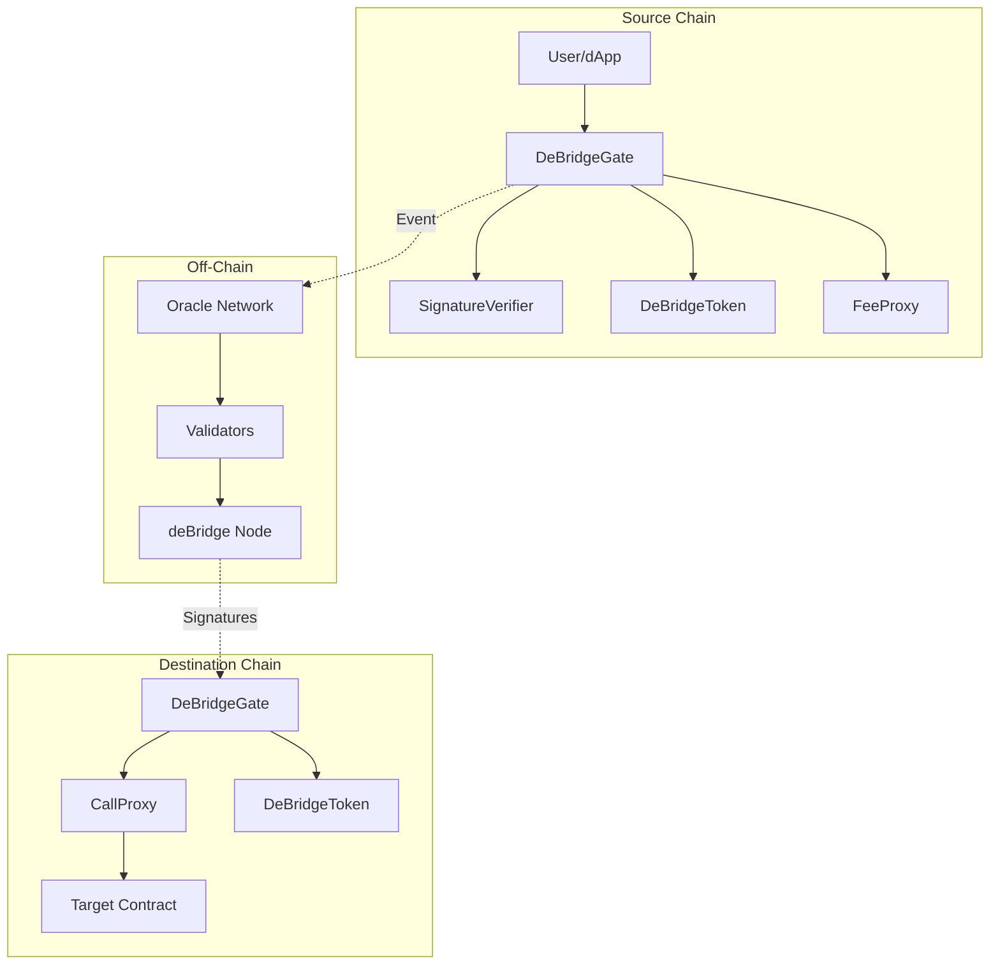
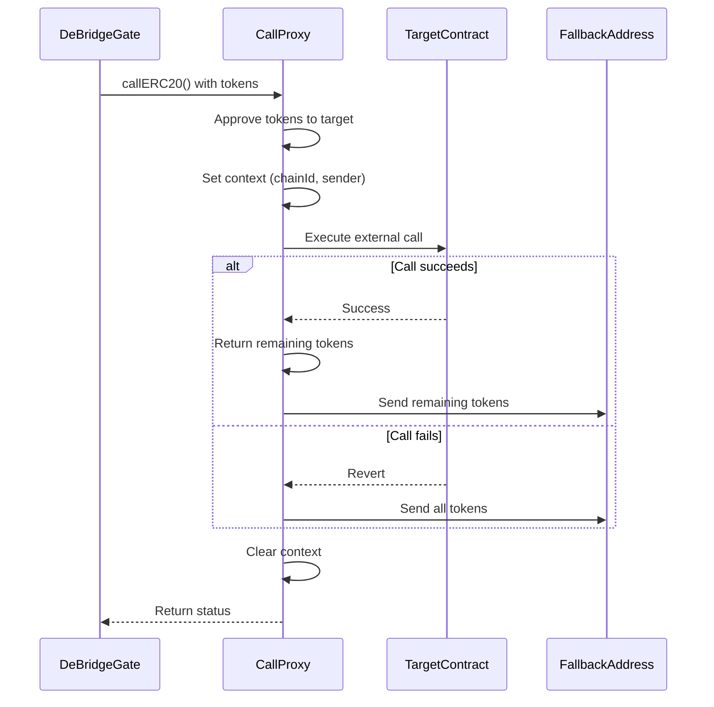

# System Architecture

The deBridge Protocol consists of multiple interconnected smart contracts and off-chain components that work together to enable secure cross-chain asset transfers and messaging.

## Architecture Overview



## Core Components

### 1. DeBridgeGate

The central contract that handles all cross-chain operations.

**Location**: `contracts/transfers/DeBridgeGate.sol`

**Key Responsibilities**:

<CardGroup cols={2}>
  <Card title="Asset Management" icon="coins">
    - Locks assets on native chain
    - Unlocks assets on destination
    - Burns deAssets when bridging back
    - Tracks balances and reserves
  </Card>
  
  <Card title="Message Handling" icon="envelope">
    - Submits cross-chain messages
    - Generates unique submission IDs
    - Emits events for validators
    - Manages execution parameters
  </Card>
  
  <Card title="Fee Collection" icon="dollar-sign">
    - Collects protocol fees
    - Applies transfer fees
    - Manages fee discounts
    - Handles native and asset fees
  </Card>
  
  <Card title="Security" icon="shield">
    - Verifies validator signatures
    - Enforces confirmation thresholds
    - Implements pause mechanism
    - Validates chain support
  </Card>
</CardGroup>

**Key Functions**:

```solidity contracts/interfaces/IDeBridgeGate.sol
interface IDeBridgeGate {
    // Send assets to another chain
    function send(
        address _tokenAddress,
        uint256 _amount,
        uint256 _chainIdTo,
        bytes memory _receiver,
        bytes memory _permitEnvelope,
        bool _useAssetFee,
        uint32 _referralCode,
        bytes calldata _autoParams
    ) external payable returns (bytes32 submissionId);
    
    // Send message without assets
    function sendMessage(
        uint256 _dstChainId,
        bytes memory _targetContractAddress,
        bytes memory _targetContractCalldata
    ) external payable returns (bytes32 submissionId);
    
    // Claim on destination chain
    function claim(
        bytes32 _debridgeId,
        uint256 _amount,
        uint256 _chainIdFrom,
        address _receiver,
        uint256 _nonce,
        bytes calldata _signatures,
        bytes calldata _autoParams
    ) external;
}
```

### 2. DeBridgeToken (deAssets)

Wrapped token representation of native assets on secondary chains.

**Location**: `contracts/periphery/DeBridgeToken.sol`

**Key Features**:

- ERC20-compliant wrapped tokens
- Mintable only by authorized DeBridgeGate
- Burnable when bridging back to native chain
- Pausable for emergency situations
- Supports EIP-2612 permit for gasless approvals

```solidity contracts/interfaces/IDeBridgeToken.sol
interface IDeBridgeToken {
    // Mint deAssets (only MINTER_ROLE)
    function mint(address _receiver, uint256 _amount) external;
    
    // Burn deAssets (only MINTER_ROLE)
    function burn(uint256 _amount) external;
    
    // EIP-2612 permit
    function permit(
        address _owner,
        address _spender,
        uint256 _value,
        uint256 _deadline,
        uint8 _v,
        bytes32 _r,
        bytes32 _s
    ) external;
}
```

**Token Lifecycle**:

<Steps>
  <Step title="Asset Locked">
    User locks native token on the source chain via DeBridgeGate.send()
  </Step>
  
  <Step title="deAsset Minted">
    After validation, DeBridgeToken.mint() creates wrapped tokens on destination
  </Step>
  
  <Step title="deAsset Used">
    User can transfer, trade, or use deAsset like any ERC20 token
  </Step>
  
  <Step title="deAsset Burned">
    When bridging back, DeBridgeToken.burn() destroys the wrapped token
  </Step>
  
  <Step title="Asset Unlocked">
    Original asset is unlocked on the native chain
  </Step>
</Steps>

### 3. CallProxy

Executes external contract calls on the destination chain.

**Location**: `contracts/periphery/CallProxy.sol`

**Purpose**: Enables cross-chain composability by executing arbitrary contract calls with transferred assets.

**Key Features**:

- Executes calls on behalf of users
- Handles both native and ERC20 token transfers
- Provides fallback mechanism if call fails
- Supports multi-send for batched operations
- Exposes submission metadata (chain ID, native sender)

```solidity contracts/interfaces/ICallProxy.sol
interface ICallProxy {
    // Execute call with native tokens
    function call(
        address _reserveAddress,      // fallback recipient
        address _receiver,             // contract to call
        bytes memory _data,            // calldata
        uint256 _flags,                // execution flags
        bytes memory _nativeSender,    // original sender
        uint256 _chainIdFrom           // source chain
    ) external payable returns (bool);
    
    // Execute call with ERC20 tokens
    function callERC20(
        address _token,
        address _reserveAddress,
        address _receiver,
        bytes memory _data,
        uint256 _flags,
        bytes memory _nativeSender,
        uint256 _chainIdFrom
    ) external returns (bool);
    
    // Get submission context
    function submissionChainIdFrom() external view returns (uint256);
    function submissionNativeSender() external view returns (bytes memory);
}
```

**Execution Flow**:



### 4. Signature Verification

Validates oracle signatures to ensure cross-chain transaction authenticity.

**Location**: `contracts/transfers/SignatureVerifier.sol`

**Key Responsibilities**:

- Verifies ECDSA signatures from validators
- Enforces minimum confirmation requirements
- Checks for required oracle participation
- Prevents signature reuse

**Confirmation Logic**:

```solidity
// Defined in DeBridgeGate.sol:573-586
function _checkConfirmations(
    bytes32 _submissionId,
    bytes32 _debridgeId,
    uint256 _amount,
    bytes calldata _signatures
) internal {
    if (isBlockedSubmission[_submissionId]) revert SubmissionBlocked();
    
    // Use excessConfirmations if amount exceeds threshold
    ISignatureVerifier(signatureVerifier).submit(
        _submissionId,
        _signatures,
        _amount >= getAmountThreshold[_debridgeId] ? excessConfirmations : 0
    );
}
```

### 5. OraclesManager

Manages the validator set and confirmation requirements.

**Location**: `contracts/transfers/OraclesManager.sol`

**Key Features**:

<Tabs>
  <Tab title="Oracle Management">
    ```solidity
    // Add new oracles
    function addOracles(
        address[] memory _oracles,
        bool[] memory _required
    ) external onlyAdmin;
    
    // Update oracle status
    function updateOracle(
        address _oracle,
        bool _isValid,
        bool _required
    ) external onlyAdmin;
    ```
  </Tab>
  
  <Tab title="Confirmation Settings">
    ```solidity
    // Set minimum confirmations
    function setMinConfirmations(
        uint8 _minConfirmations
    ) external onlyAdmin;
    
    // Set excess confirmations for large transfers
    function setExcessConfirmations(
        uint8 _excessConfirmations
    ) external onlyAdmin;
    ```
  </Tab>
</Tabs>

**Oracle Types**:

- **Regular Oracles**: Contribute to confirmation count
- **Required Oracles**: Must sign every transaction
- **Invalid Oracles**: Temporarily or permanently disabled

### 6. Fee Management

Handles fee collection, calculation, and distribution.

**Fee Types**:

<CardGroup cols={2}>
  <Card title="Fixed Native Fee" icon="coin">
    Flat fee paid in native token (e.g., ETH) per transaction
    
    ```solidity
    uint256 fixedFee = chainFees.fixedNativeFee == 0 
        ? globalFixedNativeFee 
        : chainFees.fixedNativeFee;
    ```
  </Card>
  
  <Card title="Transfer Fee" icon="percent">
    Percentage-based fee on transferred amount (in basis points)
    
    ```solidity
    uint256 transferFee = (chainFees.transferFeeBps == 0
        ? globalTransferFeeBps 
        : chainFees.transferFeeBps)
        * (_amount - assetsFixedFee) / BPS_DENOMINATOR;
    ```
  </Card>
</CardGroup>

**Fee Discounts**:

Protocol supports per-address discounts on both fixed and transfer fees:

```solidity
struct DiscountInfo {
    uint16 discountFixBps;      // Fixed fee discount in BPS
    uint16 discountTransferBps; // Transfer fee discount in BPS
}
```

## Data Structures

### DebridgeInfo

Stores information about each bridged asset:

```solidity
struct DebridgeInfo {
    uint256 chainId;           // Native chain ID
    uint256 maxAmount;         // Maximum transfer amount
    uint256 balance;           // Total locked/minted amount
    uint256 lockedInStrategies; // Amount in DeFi strategies
    address tokenAddress;      // Token address on this chain
    uint16 minReservesBps;    // Minimum reserve ratio
    bool exist;               // Whether asset is registered
}
```

### Submission Auto Parameters

Controls automated execution on destination chain:

```solidity
struct SubmissionAutoParamsTo {
    uint256 executionFee;     // Fee for executor
    uint256 flags;            // Execution flags
    bytes fallbackAddress;    // Recipient if call fails
    bytes data;               // Calldata to execute
}

struct SubmissionAutoParamsFrom {
    uint256 executionFee;
    uint256 flags;
    address fallbackAddress;
    bytes data;
    bytes nativeSender;       // Original sender on source chain
}
```

### Execution Flags

Control execution behavior via the Flags library:

```solidity contracts/libraries/Flags.sol
library Flags {
    uint256 public constant UNWRAP_ETH = 0;                    // Unwrap WETH to ETH
    uint256 public constant REVERT_IF_EXTERNAL_FAIL = 1;       // Revert if call fails
    uint256 public constant PROXY_WITH_SENDER = 2;             // Store sender context
    uint256 public constant SEND_HASHED_DATA = 3;              // Data is pre-hashed
    uint256 public constant SEND_EXTERNAL_CALL_GAS_LIMIT = 4; // Include gas limit
    uint256 public constant MULTI_SEND = 5;                    // Batch multiple calls
}
```

## Off-Chain Components

### Validator Network

Decentralized network of independent validators:

<Steps>
  <Step title="Event Monitoring">
    Validators run deBridge nodes that monitor `Sent` events on all supported chains
  </Step>
  
  <Step title="Transaction Validation">
    Each validator independently validates the transaction details and checks chain state
  </Step>
  
  <Step title="Signature Generation">
    Valid transactions are signed using the validator's private key (ECDSA)
  </Step>
  
  <Step title="Signature Aggregation">
    Signatures are collected until minimum threshold is reached
  </Step>
  
  <Step title="Claim Execution">
    Keepers execute the claim transaction on destination with aggregated signatures
  </Step>
</Steps>

**Security Model**:

- Validators have economic stake that can be slashed
- Minimum threshold prevents single validator attacks  
- Required validators ensure critical nodes participate
- Excess confirmations for high-value transfers

### deBridge Node

Validators run deBridge node software that:

- Monitors all supported blockchains
- Validates cross-chain transactions
- Signs valid submissions
- Submits signatures to aggregation layer
- Participates in governance

## Security Features

<CardGroup cols={2}>
  <Card title="Pausable" icon="pause">
    Admin can pause transfers in emergency situations
    
    ```solidity
    function pause() external onlyGovMonitoring {
        _pause();
    }
    ```
  </Card>
  
  <Card title="Reentrancy Protection" icon="lock">
    All state-changing functions use ReentrancyGuard
    
    ```solidity
    function send(...) 
        external 
        nonReentrant 
        whenNotPaused
    ```
  </Card>
  
  <Card title="Submission Blocking" icon="ban">
    Admin can block suspicious submissions
    
    ```solidity
    function blockSubmission(
        bytes32[] memory _submissionIds,
        bool isBlocked
    ) external onlyAdmin;
    ```
  </Card>
  
  <Card title="Signature Verification" icon="signature">
    Multiple validator signatures required for each transfer
    
    ```solidity
    ISignatureVerifier(signatureVerifier)
        .submit(_submissionId, _signatures, ...);
    ```
  </Card>
</CardGroup>

## Upgradeability

The protocol uses OpenZeppelin's upgradeable contract pattern:

- Contracts are deployed behind proxies
- Storage layout must be preserved across upgrades
- Initialization instead of constructors
- Gap variables for future storage slots

```solidity
contract DeBridgeGate is
    Initializable,
    AccessControlUpgradeable,
    PausableUpgradeable,
    ReentrancyGuardUpgradeable
{
    // ... implementation
}
```

## Chain Support

The protocol tracks supported chains for sending and receiving:

```solidity
struct ChainSupportInfo {
    uint256 fixedNativeFee;   // Chain-specific fixed fee
    bool isSupported;         // Whether chain is enabled
    uint16 transferFeeBps;    // Chain-specific transfer fee
}

mapping(uint256 => ChainSupportInfo) public getChainToConfig;   // Outgoing
mapping(uint256 => ChainSupportInfo) public getChainFromConfig; // Incoming
```

Admin can enable/disable chains and adjust fees per chain.

## Performance Considerations

<Tip>
  **Gas Optimization**: The protocol normalizes token amounts to reduce dust and uses efficient storage patterns to minimize gas costs.
</Tip>

```solidity contracts/transfers/DeBridgeGate.sol:987-1000
function _normalizeTokenAmount(
    address _token,
    uint256 _amount
) internal view returns (uint256) {
    uint256 decimals = _token == address(0)
        ? 18
        : IERC20Metadata(_token).decimals();
    uint256 maxDecimals = 8;
    if (decimals > maxDecimals) {
        uint256 multiplier = 10 ** (decimals - maxDecimals);
        _amount = _amount / multiplier * multiplier;
    }
    return _amount;
}
```

## Next Steps

<CardGroup cols={2}>
  <Card title="Understand Transfers" icon="exchange" href="/concepts/transfers">
    Learn the details of the lock-and-mint mechanism
  </Card>
  
  <Card title="Explore Oracles" icon="network-wired" href="/concepts/oracles">
    Deep dive into the validator network and consensus
  </Card>
  
  <Card title="Integration Guide" icon="code" href="/integration/overview">
    Start integrating deBridge into your application
  </Card>
  
  <Card title="Fee Structure" icon="dollar-sign" href="/concepts/fees">
    Understand protocol fees and optimization strategies
  </Card>
</CardGroup>