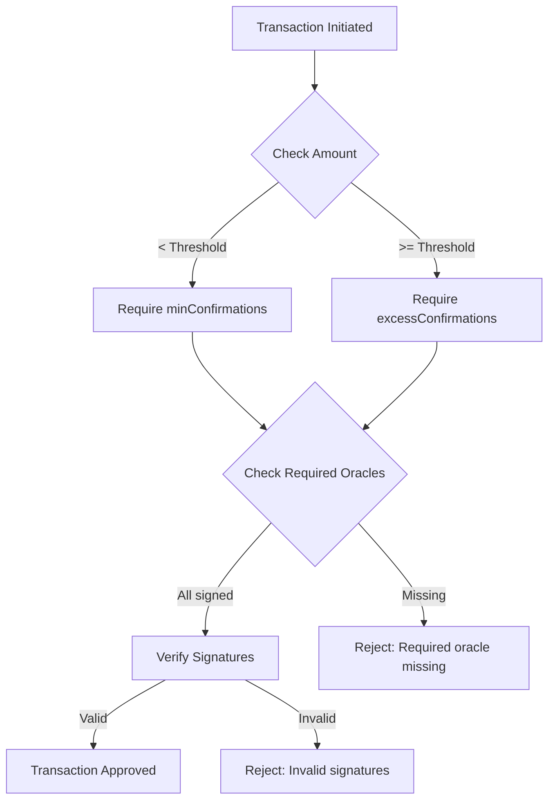

# Oracle Network

The deBridge Protocol relies on a decentralized network of validators (oracles) to secure cross-chain transfers. This page explains how the oracle network operates, the consensus mechanism, and the economic security model.

## Overview

The oracle network is responsible for:

<CardGroup cols={2}>
  <Card title="Transaction Validation" icon="check-circle">
    Independently verify all cross-chain transactions on source chains
  </Card>
  
  <Card title="Signature Generation" icon="signature">
    Sign valid transactions using ECDSA private keys
  </Card>
  
  <Card title="Consensus" icon="users">
    Reach agreement through signature threshold requirements
  </Card>
  
  <Card title="Security" icon="shield">
    Provide economic security through staking and slashing
  </Card>
</CardGroup>

## Validator Roles

### Oracle Types

Validators can have different roles in the network:

<Tabs>
  <Tab title="Regular Oracle">
    **Regular Oracles** participate in validation and contribute to the signature threshold.
    
    ```solidity contracts/transfers/OraclesManager.sol:98-102
    oracleInfo.exist = true;
    oracleInfo.isValid = true;
    oracleInfo.required = false;  // Not required for every tx
    ```
    
    - Can be added/removed by governance
    - Signatures count toward minimum threshold
    - Optional for individual transactions
  </Tab>
  
  <Tab title="Required Oracle">
    **Required Oracles** must sign every transaction.
    
    ```solidity contracts/transfers/OraclesManager.sol:95-101
    if (_required[i]) {
        requiredOraclesCount += 1;
    }
    oracleInfo.exist = true;
    oracleInfo.isValid = true;
    oracleInfo.required = true;  // Must sign every tx
    ```
    
    - Critical validators that must always participate
    - Provides additional security layer
    - Transactions fail without their signature
  </Tab>
  
  <Tab title="Invalid Oracle">
    **Invalid Oracles** are temporarily or permanently disabled.
    
    ```solidity
    oracleInfo.isValid = false;
    oracleInfo.required = false;
    ```
    
    - Can be disabled for maintenance or misbehavior
    - Signatures are ignored
    - Can be re-enabled by governance
  </Tab>
</Tabs>

## Consensus Mechanism

### Signature Verification

Every cross-chain transaction requires a minimum number of validator signatures:

```solidity contracts/transfers/DeBridgeGate.sol:573-586
function _checkConfirmations(
    bytes32 _submissionId,
    bytes32 _debridgeId,
    uint256 _amount,
    bytes calldata _signatures
) internal {
    if (isBlockedSubmission[_submissionId]) revert SubmissionBlocked();
    
    // Use excessConfirmations if amount exceeds threshold
    ISignatureVerifier(signatureVerifier).submit(
        _submissionId,
        _signatures,
        _amount >= getAmountThreshold[_debridgeId] 
            ? excessConfirmations  // More signatures for large transfers
            : 0                     // Standard minConfirmations
    );
}
```

### Confirmation Thresholds

The protocol uses dynamic confirmation requirements:

<Steps>
  <Step title="Minimum Confirmations">
    Base threshold that all transactions must meet:
    
    ```solidity contracts/transfers/OraclesManager.sol:14
    uint8 public minConfirmations;
    ```
    
    Typically set to `N/2 + 1` where N is the number of validators (Byzantine fault tolerance).
  </Step>
  
  <Step title="Excess Confirmations">
    Higher threshold for large-value transfers:
    
    ```solidity contracts/transfers/OraclesManager.sol:16
    uint8 public excessConfirmations;
    ```
    
    Applied when `transferAmount >= amountThreshold[debridgeId]`.
  </Step>
  
  <Step title="Required Oracles">
    Specific validators that must always sign:
    
    ```solidity contracts/transfers/OraclesManager.sol:18
    uint8 public requiredOraclesCount;
    ```
    
    Ensures critical validators participate in every transaction.
  </Step>
</Steps>

### Confirmation Logic Example



## OraclesManager Contract

The OraclesManager contract handles validator registration and configuration.

**Location**: `contracts/transfers/OraclesManager.sol`

### Key Functions

<Tabs>
  <Tab title="Add Oracles">
    ```solidity contracts/transfers/OraclesManager.sol:82-105
    function addOracles(
        address[] memory _oracles,
        bool[] memory _required
    ) external onlyAdmin {
        if (_oracles.length != _required.length) revert WrongArgument();
        
        // Ensure sufficient security after adding
        if (minConfirmations < (oracleAddresses.length + _oracles.length) / 2 + 1) {
            revert LowMinConfirmations();
        }
        
        for (uint256 i = 0; i < _oracles.length; i++) {
            OracleInfo storage oracleInfo = getOracleInfo[_oracles[i]];
            if (oracleInfo.exist) revert OracleAlreadyExist();
            
            oracleAddresses.push(_oracles[i]);
            
            if (_required[i]) {
                requiredOraclesCount += 1;
            }
            
            oracleInfo.exist = true;
            oracleInfo.isValid = true;
            oracleInfo.required = _required[i];
            
            emit AddOracle(_oracles[i], _required[i]);
        }
    }
    ```
  </Tab>
  
  <Tab title="Update Oracle">
    ```solidity contracts/transfers/OraclesManager.sol:111-143
    function updateOracle(
        address _oracle,
        bool _isValid,
        bool _required
    ) external onlyAdmin {
        // Invalid oracles cannot be required
        if (!_isValid && _required) revert WrongArgument();
        
        OracleInfo storage oracleInfo = getOracleInfo[_oracle];
        if (!oracleInfo.exist) revert OracleNotFound();
        
        // Update required count
        if (oracleInfo.required && !_required) {
            requiredOraclesCount -= 1;
        } else if (!oracleInfo.required && _required) {
            requiredOraclesCount += 1;
        }
        
        // Update oracle list if validity changes
        if (oracleInfo.isValid && !_isValid) {
            // Remove from active list
            for (uint256 i = 0; i < oracleAddresses.length; i++) {
                if (oracleAddresses[i] == _oracle) {
                    oracleAddresses[i] = oracleAddresses[oracleAddresses.length - 1];
                    oracleAddresses.pop();
                    break;
                }
            }
        } else if (!oracleInfo.isValid && _isValid) {
            // Add back to active list
            if (minConfirmations < (oracleAddresses.length + 1) / 2 + 1) {
                revert LowMinConfirmations();
            }
            oracleAddresses.push(_oracle);
        }
        
        oracleInfo.isValid = _isValid;
        oracleInfo.required = _required;
        emit UpdateOracle(_oracle, _required, _isValid);
    }
    ```
  </Tab>
  
  <Tab title="Set Thresholds">
    ```solidity contracts/transfers/OraclesManager.sol:66-77
    function setMinConfirmations(uint8 _minConfirmations) external onlyAdmin {
        // Must be > 50% for Byzantine fault tolerance
        if (_minConfirmations < oracleAddresses.length / 2 + 1) {
            revert LowMinConfirmations();
        }
        minConfirmations = _minConfirmations;
    }
    
    function setExcessConfirmations(uint8 _excessConfirmations) external onlyAdmin {
        if (_excessConfirmations < minConfirmations) revert LowMinConfirmations();
        excessConfirmations = _excessConfirmations;
    }
    ```
  </Tab>
</Tabs>

### Oracle Data Structure

```solidity
struct OracleInfo {
    bool exist;      // Whether oracle is registered
    bool isValid;    // Whether oracle is currently active
    bool required;   // Whether oracle must sign every tx
}

mapping(address => OracleInfo) public getOracleInfo;
address[] public oracleAddresses;  // List of active oracles
```

## SignatureVerifier Contract

Verifies ECDSA signatures from validators.

**Location**: `contracts/transfers/SignatureVerifier.sol`

### Signature Verification Process

<Steps>
  <Step title="Submit Signatures">
    Caller provides submissionId and packed signatures:
    
    ```solidity
    function submit(
        bytes32 _submissionId,
        bytes calldata _signatures,
        uint8 _excessConfirmations
    ) external;
    ```
  </Step>
  
  <Step title="Parse Signatures">
    Extract individual ECDSA signatures (65 bytes each: r, s, v):
    
    ```solidity
    // Each signature: 32 bytes r + 32 bytes s + 1 byte v
    for (uint256 i = 0; i < _signatures.length; i += 65) {
        bytes32 r = bytes32(_signatures[i:i+32]);
        bytes32 s = bytes32(_signatures[i+32:i+64]);
        uint8 v = uint8(_signatures[i+64]);
        
        address signer = ecrecover(_submissionId, v, r, s);
        // ...
    }
    ```
  </Step>
  
  <Step title="Validate Signers">
    Verify each signer is a valid oracle:
    
    ```solidity
    OracleInfo memory oracleInfo = getOracleInfo[signer];
    require(oracleInfo.isValid, "Invalid oracle");
    
    validSignatures++;
    if (oracleInfo.required) {
        requiredSignatures++;
    }
    ```
  </Step>
  
  <Step title="Check Thresholds">
    Ensure minimum and required thresholds are met:
    
    ```solidity
    uint8 requiredConfirmations = _excessConfirmations > 0
        ? Math.max(excessConfirmations, minConfirmations)
        : minConfirmations;
    
    require(
        validSignatures >= requiredConfirmations,
        "Insufficient confirmations"
    );
    require(
        requiredSignatures == requiredOraclesCount,
        "Missing required oracle"
    );
    ```
  </Step>
</Steps>

## Security Model

### Economic Security

The protocol's security is backed by economic incentives:

<CardGroup cols={2}>
  <Card title="Staking" icon="coins">
    Validators must stake tokens as collateral
    
    - Provides skin in the game
    - Acts as security deposit
    - Can be slashed for misbehavior
  </Card>
  
  <Card title="Slashing" icon="gavel">
    Malicious validators lose their stake
    
    - Automatic for provable fraud
    - Governance-triggered for disputes
    - Distributed to honest validators
  </Card>
  
  <Card title="Rewards" icon="trophy">
    Honest validators earn rewards
    
    - Share of protocol fees
    - Additional token emissions
    - Proportional to stake
  </Card>
  
  <Card title="Delegation" icon="users">
    Token holders can delegate to validators
    
    - Earn share of rewards
    - Share slashing risk
    - Participate in security
  </Card>
</CardGroup>

### Attack Resistance

<AccordionGroup>
  <Accordion title="51% Attack Protection">
    Minimum confirmations require >50% of validators:
    
    ```solidity
    minConfirmations = oracleAddresses.length / 2 + 1;
    ```
    
    An attacker needs to control majority of stake to forge transactions.
  </Accordion>
  
  <Accordion title="Required Oracle Enforcement">
    Critical validators must sign every transaction:
    
    ```solidity
    require(
        requiredSignatures == requiredOraclesCount,
        "Missing required oracle signature"
    );
    ```
    
    Even with majority stake, attacker cannot bypass required oracles.
  </Accordion>
  
  <Accordion title="Excess Confirmations for Large Transfers">
    High-value transfers require more signatures:
    
    ```solidity
    _amount >= getAmountThreshold[_debridgeId]
        ? excessConfirmations
        : 0
    ```
    
    Makes large-value attacks even more expensive.
  </Accordion>
  
  <Accordion title="Slashing for Misbehavior">
    Economic penalties disincentivize attacks:
    
    - **Fraud Proof**: Automatic slashing for provable fraud
    - **Liveness**: Penalties for offline/non-responsive validators
    - **Spam**: Slashing for invalid signatures
  </Accordion>
</AccordionGroup>

## Validator Operations

### Running a deBridge Node

Validators run deBridge node software that:

<Steps>
  <Step title="Monitor Blockchains">
    Watch for `Sent` events on all supported chains:
    
    ```javascript
    deBridgeGate.on('Sent', async (event) => {
        const {
            submissionId,
            debridgeId,
            amount,
            receiver,
            nonce,
            chainIdTo,
            // ...
        } = event.args;
        
        await validateSubmission(event);
    });
    ```
  </Step>
  
  <Step title="Validate Transactions">
    Verify transaction legitimacy:
    
    - Check source chain state
    - Verify token balances
    - Validate protocol parameters
    - Check for double-spends
  </Step>
  
  <Step title="Sign Valid Transactions">
    Generate ECDSA signature:
    
    ```javascript
    const signature = await wallet.signMessage(
        ethers.utils.arrayify(submissionId)
    );
    
    await submitSignature(submissionId, signature);
    ```
  </Step>
  
  <Step title="Submit Signatures">
    Send signature to aggregation layer:
    
    - Collect signatures from all validators
    - Wait for threshold to be reached
    - Submit aggregated signatures to destination
  </Step>
</Steps>

### Validator Requirements

**Infrastructure**:
- Full nodes for all supported chains
- High availability (99.9%+ uptime)
- Secure key management (HSM recommended)
- Monitoring and alerting

**Stake**:
- Minimum stake requirement (set by governance)
- Locked for unbonding period
- Subject to slashing

**Reputation**:
- Track record of honest behavior
- Community standing
- Technical competence

## Governance

The validator set is managed by deBridge DAO:

<Tabs>
  <Tab title="Adding Validators">
    Governance proposal to add new validators:
    
    ```solidity
    // Proposal: Add new oracles
    address[] memory newOracles = [oracle1, oracle2];
    bool[] memory required = [false, false];
    
    oraclesManager.addOracles(newOracles, required);
    ```
  </Tab>
  
  <Tab title="Removing Validators">
    Disable misbehaving or inactive validators:
    
    ```solidity
    // Proposal: Disable oracle
    oraclesManager.updateOracle(
        oracleAddress,
        false,  // isValid = false
        false   // required = false
    );
    ```
  </Tab>
  
  <Tab title="Adjusting Parameters">
    Modify confirmation thresholds:
    
    ```solidity
    // Proposal: Increase minimum confirmations
    oraclesManager.setMinConfirmations(newMinConfirmations);
    oraclesManager.setExcessConfirmations(newExcessConfirmations);
    ```
  </Tab>
  
  <Tab title="Emergency Actions">
    Admin can pause transfers in emergencies:
    
    ```solidity
    // Emergency: Pause protocol
    deBridgeGate.pause();
    
    // When resolved: Resume
    deBridgeGate.unpause();
    ```
  </Tab>
</Tabs>

## Monitoring and Transparency

### Events

```solidity
// Oracle management events
event AddOracle(address oracle, bool required);
event UpdateOracle(address oracle, bool required, bool isValid);

// Monitoring events for analytics
event MonitoringSendEvent(
    bytes32 submissionId,
    uint256 nonce,
    uint256 lockedOrMintedAmount,
    uint256 totalSupply
);

event MonitoringClaimEvent(
    bytes32 submissionId,
    uint256 lockedOrMintedAmount,
    uint256 totalSupply
);
```

### Public Data

All validator information is publicly accessible:

```solidity
// Check oracle status
OracleInfo memory info = oraclesManager.getOracleInfo(oracleAddress);

// Get active oracles
address[] memory oracles = oraclesManager.oracleAddresses();

// Get thresholds
uint8 minConf = oraclesManager.minConfirmations();
uint8 excessConf = oraclesManager.excessConfirmations();
uint8 reqCount = oraclesManager.requiredOraclesCount();
```

## Best Practices for Integrators

<AccordionGroup>
  <Accordion title="Understand Finality Times">
    Cross-chain transfers require validator signatures, which takes time:
    
    - Typical: 2-5 minutes
    - Large transfers: 5-10 minutes (excess confirmations)
    - Network congestion may increase time
    
    Design your UX accordingly.
  </Accordion>
  
  <Accordion title="Monitor Submission Status">
    Track the status of your submissions:
    
    ```solidity
    // Check if claimed
    bool claimed = deBridgeGate.isSubmissionUsed(submissionId);
    
    // Check if blocked
    bool blocked = deBridgeGate.isBlockedSubmission(submissionId);
    ```
  </Accordion>
  
  <Accordion title="Handle Edge Cases">
    Plan for exceptional scenarios:
    
    - Validator downtime
    - Network splits
    - Protocol pauses
    - Blocked submissions
  </Accordion>
  
  <Accordion title="Verify Source Chain Finality">
    Ensure source chain transaction is final before expecting signatures:
    
    - Ethereum: Wait for ~12 confirmations
    - BSC: Wait for ~15 confirmations
    - Polygon: Wait for ~128 confirmations
  </Accordion>
</AccordionGroup>

<Info>
  The deBridge oracle network provides strong security guarantees through economic incentives, Byzantine fault tolerance, and transparent governance.
</Info>

## Next Steps

<CardGroup cols={2}>
  <Card title="Fee Structure" icon="dollar-sign" href="/concepts/fees">
    Learn about protocol fees and validator rewards
  </Card>
  
  <Card title="Asset Transfers" icon="exchange" href="/concepts/transfers">
    Understand how validators secure transfers
  </Card>
  
  <Card title="Architecture" icon="building" href="/architecture">
    See how oracles fit in the overall architecture
  </Card>
  
  <Card title="Integration Guide" icon="code" href="/integration/overview">
    Start building with deBridge Protocol
  </Card>
</CardGroup>