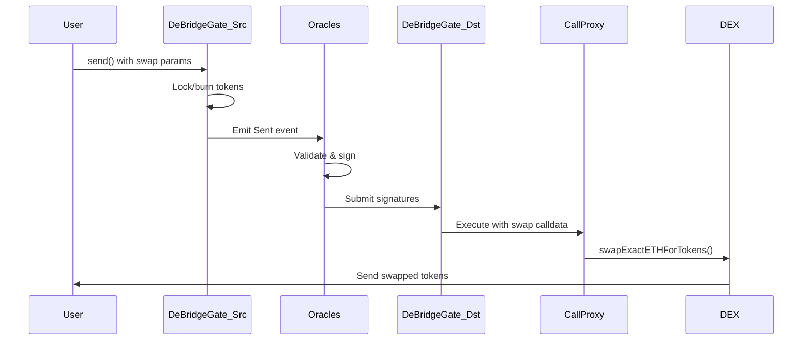

## Overview

Cross-chain swaps allow you to send one token on a source chain and receive a different token on the destination chain, combining bridging with DEX swaps.

**Script Location**: `examples/src/sendScripts/swap/swap.ts`

## Quick Start

```bash Run Cross-Chain Swap
yarn ts-node examples/src/sendScripts/swap/swap.ts \
  --chain-id-from 97 \
  --chain-id-to 42 \
  --token-address-from 0x0000000000000000000000000000000000000000 \
  --token-address-to 0x0000000000000000000000000000000000000000 \
  --amount 0.1
```

This swaps 0.1 BNB on BSC testnet to ETH on Kovan testnet.

## How It Works

<Steps>
  <Step title="Send Token to deBridge">
    Lock or burn the source token on the source chain
  </Step>
  
  <Step title="Bridge to Destination">
    Oracle network validates and bridges the value
  </Step>
  
  <Step title="Automatic Swap on Destination">
    CallProxy executes a DEX swap to the target token
  </Step>
  
  <Step title="Receive Target Token">
    Final token is sent to your address on destination chain
  </Step>
</Steps>

## Configuration

```bash .env
DEBRIDGEGATE_ADDRESS=0x...        # DeBridgeGate contract
ROUTER_ADDRESS=0x...               # DEX router on destination (Uniswap V2, PancakeSwap, etc.)
SENDER_PRIVATE_KEY=0x...
```

## Example: BNB to USDC Swap

```typescript Cross-Chain Swap
import { ethers } from 'ethers';
import { DeBridgeGate__factory } from '../typechain-types';

async function crossChainSwap() {
    // Setup
    const provider = new ethers.providers.JsonRpcProvider(process.env.RPC_URL);
    const wallet = new ethers.Wallet(process.env.SENDER_PRIVATE_KEY!, provider);
    const debridgeGate = DeBridgeGate__factory.connect(
        process.env.DEBRIDGEGATE_ADDRESS!,
        wallet
    );
    
    // Swap parameters
    const amountIn = ethers.utils.parseEther('1');      // 1 BNB
    const chainIdTo = 1;                                  // Ethereum
    const tokenOut = '0xA0b86...';                       // USDC address on Ethereum
    const minAmountOut = ethers.utils.parseUnits('500', 6); // Minimum 500 USDC
    const deadline = Math.floor(Date.now() / 1000) + 1800;  // 30 minutes
    
    // Encode swap calldata for Uniswap V2
    const swapCalldata = new ethers.utils.Interface([
        'function swapExactETHForTokens(uint amountOutMin, address[] calldata path, address to, uint deadline)'
    ]).encodeFunctionData('swapExactETHForTokens', [
        minAmountOut,
        [WETH_ADDRESS, tokenOut],                         // Swap path
        wallet.address,                                   // Receiver
        deadline
    ]);
    
    // Execution fee for automatic execution
    const executionFee = ethers.utils.parseEther('0.02');
    
    // Encode auto params for CallProxy
    const autoParams = ethers.utils.defaultAbiCoder.encode(
        ['tuple(uint256,uint256,bytes,bytes)'],
        [[
            executionFee,
            0,                                            // Flags
            ethers.utils.hexZeroPad(wallet.address, 32), // Fallback
            swapCalldata                                  // DEX swap calldata
        ]]
    );
    
    // Send with swap
    const protocolFee = await debridgeGate.globalFixedNativeFee();
    const totalValue = amountIn.add(protocolFee).add(executionFee);
    
    const tx = await debridgeGate.send(
        ethers.constants.AddressZero,                     // BNB (native)
        amountIn,
        chainIdTo,
        ethers.utils.hexZeroPad(process.env.ROUTER_ADDRESS!, 32), // Router as receiver
        '0x',
        false,
        0,
        autoParams,                                        // Swap on destination
        { value: totalValue }
    );
    
    console.log('Swap initiated:', tx.hash);
    const receipt = await tx.wait();
    
    const submissionId = receipt.events?.find(e => e.event === 'Sent')?.args?.submissionId;
    console.log('Track at:', `https://explorer.debridge.finance/tx/${submissionId}`);
}

crossChainSwap().catch(console.error);
```

## Token Combinations

### Native to Native

Swap ETH on Ethereum to BNB on BSC:

```bash
--token-address-from 0x0000000000000000000000000000000000000000 \
--token-address-to 0x0000000000000000000000000000000000000000
```

### Native to ERC-20

Swap BNB to USDC:

```bash
--token-address-from 0x0000000000000000000000000000000000000000 \
--token-address-to 0x...[USDC address]
```

### ERC-20 to ERC-20

Swap USDC to DAI:

```bash
--token-address-from 0x...[USDC] \
--token-address-to 0x...[DAI]
```

## Slippage Protection

```typescript Setting Slippage Tolerance
// Calculate minimum output with 1% slippage
const expectedOutput = await getExpectedOutput(amountIn, path);
const slippageTolerance = 100; // 1% in basis points
const minAmountOut = expectedOutput.mul(10000 - slippageTolerance).div(10000);

// Use in swap
const swapCalldata = router.interface.encodeFunctionData('swapExactETHForTokens', [
    minAmountOut,  // Minimum tokens to receive
    path,
    receiver,
    deadline
]);
```

<Warning>
  Always set reasonable slippage protection. Without it, your swap can be frontrun or receive unfavorable rates.
</Warning>

## DEX Router Addresses

Common DEX routers for cross-chain swaps:

**Ethereum**
- Uniswap V2: `0x7a250d5630B4cF539739dF2C5dAcb4c659F2488D`
- Uniswap V3: `0xE592427A0AEce92De3Edee1F18E0157C05861564`
- SushiSwap: `0xd9e1cE17f2641f24aE83637ab66a2cca9C378B9F`

**BSC**
- PancakeSwap V2: `0x10ED43C718714eb63d5aA57B78B54704E256024E`
- PancakeSwap V3: `0x13f4EA83D0bd40E75C8222255bc855a974568Dd4`

**Polygon**
- QuickSwap: `0xa5E0829CaCEd8fFDD4De3c43696c57F7D7A678ff`
- Uniswap V3: `0xE592427A0AEce92De3Edee1F18E0157C05861564`

## Execution Flow



## Error Handling

<Accordion title="Swap fails - receive original token">
  
  If the DEX swap fails (slippage, liquidity, etc.), you can configure a fallback:
  
  ```typescript
  const autoParams = encode([
      executionFee,
      flags,
      myWalletAddress,  // Fallback: send bridged token to me
      swapCalldata
  ]);
  ```
  
  If swap fails, you receive the bridged token instead.
  
</Accordion>

<Accordion title="Insufficient liquidity">
  
  The DEX doesn't have enough liquidity for your swap size.
  
  **Solutions**:
  - Reduce swap amount
  - Increase slippage tolerance (carefully!)
  - Use a different DEX or token pair
  - Split into multiple smaller swaps
  
</Accordion>

<Accordion title="Execution fee too low">
  
  Keepers won't execute the swap due to insufficient incentive.
  
  **Solution**: Increase execution fee:
  ```typescript
  const executionFee = ethers.utils.parseEther('0.05'); // Higher fee
  ```
  
</Accordion>

## Advanced: Multi-Hop Swaps

Swap through multiple token pairs:

```typescript Multi-Hop Path
const path = [
    WBNB_ADDRESS,   // Start: BNB
    BUSD_ADDRESS,   // Intermediate: BUSD
    USDC_ADDRESS    // End: USDC
];

const swapCalldata = router.interface.encodeFunctionData(
    'swapExactETHForTokens',
    [minAmountOut, path, receiver, deadline]
);
```

## Testing

Test on testnets first:

1. **BSC Testnet → Goerli**
2. **Use test tokens** (faucets available)
3. **Small amounts** to verify flow
4. **Check explorer** for each step
5. **Verify final balance** on destination

<Tip>
  Start with native-to-native swaps (ETH → BNB) as they're simpler and have better liquidity on testnets.
</Tip>

## Related Documentation

<CardGroup cols={2}>
  <Card title="Cross-Chain Calls" icon="message" href="/integration/cross-chain-calls">
    Learn about CallProxy and autoParams
  </Card>
  <Card title="Sending Assets" icon="arrow-right-arrow-left" href="/integration/sending-assets">
    Asset transfer integration guide
  </Card>
</CardGroup>