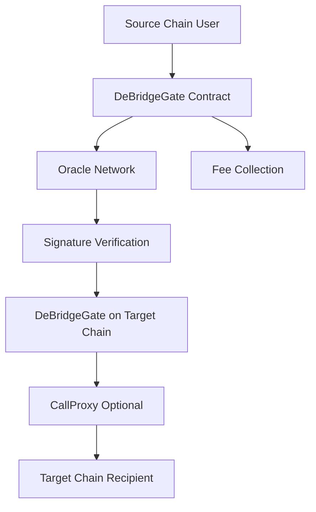

# Introduction to deBridge Protocol

deBridge is a **cross-chain interoperability and liquidity transfer protocol** that enables the decentralized transfer of arbitrary data and assets between various blockchains.

## What is deBridge?

deBridge Protocol provides infrastructure for:

- **Decentralized transfer of arbitrary data and assets** across blockchains
- **Cross-chain interoperability and composability** of smart contracts
- **Cross-chain swaps** with seamless user experience
- **NFT bridging** with preservation of custom logic

## Key Capabilities

<CardGroup cols={2}>
  <Card title="Asset Transfers" icon="arrows-left-right">
    Lock assets on the native chain and mint wrapped deAssets on secondary chains using a secure lock-and-mint mechanism.
  </Card>
  
  <Card title="Cross-Chain Messaging" icon="message">
    Send arbitrary data and execute smart contract calls across different blockchains with flexible execution options.
  </Card>
  
  <Card title="Oracle Network" icon="network-wired">
    Decentralized validator network that signs and verifies all cross-chain transactions with staking and slashing mechanics.
  </Card>
  
  <Card title="Flexible Integration" icon="plug">
    Multiple integration patterns including direct transfers, cross-chain calls, and the BridgeAppBase pattern for complex applications.
  </Card>
</CardGroup>

## How It Works

The deBridge protocol operates through several key components:

### Smart Contracts

At the core of deBridge is the **DeBridgeGate** contract (contracts/transfers/DeBridgeGate.sol:25), which handles:
- Asset locking and unlocking
- Cross-chain message submission
- Fee collection and management
- Validator signature verification

### Validator Network

Validation of cross-chain transactions is performed by a network of independent validators who:
- Are elected by and work for deBridge governance
- Maintain blockchain infrastructure and run deBridge nodes
- Sign all transactions passing through deBridge smart contracts
- Are subject to delegated staking and slashing mechanics

### Asset Transfer Model

Assets are transferred using a **lock-and-mint** mechanism:

1. **Native Chain**: Assets are locked in the DeBridgeGate contract
2. **Secondary Chain**: Wrapped assets (deAssets) are minted via DeBridgeToken contracts
3. **Return Transfer**: deAssets are burned and original assets are unlocked

## Use Cases

Projects can integrate with deBridge infrastructure to:

<AccordionGroup>
  <Accordion title="Build Custom Bridges">
    Create custom bridges for assets and NFTs while preserving unique logic like NFT breeding mechanics.
  </Accordion>
  
  <Accordion title="Enable Cross-Chain Access">
    Allow users from other blockchain ecosystems to interact with your protocol seamlessly.
  </Accordion>
  
  <Accordion title="Scale to Multiple Chains">
    Expand your protocol to other chains and exchange commands/calldata between components.
  </Accordion>
  
  <Accordion title="Build Cross-Chain dApps">
    Create new types of cross-chain applications and primitives that weren't possible before.
  </Accordion>
</AccordionGroup>

## Why deBridge?

<Note>
  deBridge Protocol was the **Grand Prize Winner** of the Chainlink Global Hackathon in April 2021, taking first place among more than 140 teams worldwide.
</Note>

**Key Advantages:**

- **Security**: Decentralized validator network with economic incentives preventing collusion
- **Flexibility**: Support for arbitrary data transfer, not just assets
- **Composability**: Smart contracts can call other contracts across chains
- **Decentralized Governance**: Protocol controlled by DAO with token holder participation

## Architecture Overview

The protocol consists of several interconnected components:

## Getting Started

Ready to integrate deBridge into your project?

<CardGroup cols={2}>
  <Card title="Quickstart" icon="rocket" href="/quickstart">
    Follow our step-by-step guide to make your first cross-chain transfer
  </Card>
  
  <Card title="Architecture" icon="building" href="/architecture">
    Learn about the system architecture and how components interact
  </Card>
  
  <Card title="Integration Guide" icon="code" href="/integration/overview">
    Explore integration patterns and start building
  </Card>
  
  <Card title="Core Concepts" icon="book" href="/concepts/transfers">
    Deep dive into transfers, messaging, oracles, and fees
  </Card>
</CardGroup>

## Resources

- **Website**: [debridge.finance](https://debridge.finance)
- **Live Application**: [app.debridge.finance](https://app.debridge.finance)
- **GitHub**: [github.com/debridge-finance](https://github.com/debridge-finance)
- **Documentation Portal**: [docs.debridge.finance](https://docs.debridge.finance)

## Community

Join the deBridge community:

- **Discord**: [discord.com/invite/debridge](https://discord.com/invite/debridge)
- **Twitter**: [@DebridgeFinance](https://twitter.com/DebridgeFinance)
- **Telegram**: [t.me/deBridge_Finance](https://t.me/deBridge_Finance)
- **Medium**: [debridge.medium.com](https://debridge.medium.com)

<Info>
  The deBridge protocol will be controlled by a DAO with decentralized governance, allowing all token holders to participate in future growth and protocol parameter decisions.
</Info>