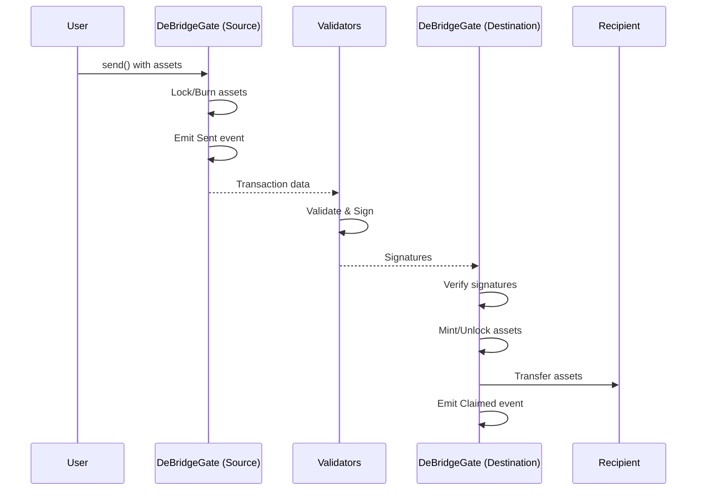

# Quickstart Guide

This guide will walk you through making your first cross-chain transfer using the deBridge Protocol.

## Prerequisites

Before you begin, ensure you have:

<Steps>
  <Step title="Development Environment">
    - Node.js v16+ and npm/yarn installed
    - Hardhat or Foundry for smart contract development
    - A code editor (VS Code recommended)
  </Step>
  
  <Step title="Blockchain Basics">
    - Understanding of Ethereum and EVM-compatible chains
    - Familiarity with Solidity smart contracts
    - Knowledge of how to interact with blockchain networks
  </Step>
  
  <Step title="Wallet and Funds">
    - A wallet with private key access (e.g., MetaMask)
    - Native tokens for gas fees on both source and destination chains
    - Test tokens for experimentation (use testnets first)
  </Step>
</Steps>

## Step 1: Install Dependencies

First, install the required packages for your project:

<Tabs>
  <Tab title="npm">
    ```bash
    npm install --save-dev @openzeppelin/contracts-upgradeable
    npm install --save-dev @openzeppelin/contracts
    ```
  </Tab>
  
  <Tab title="yarn">
    ```bash
    yarn add -D @openzeppelin/contracts-upgradeable
    yarn add -D @openzeppelin/contracts
    ```
  </Tab>
</Tabs>

## Step 2: Set Up Your Contract

Create a simple contract that interacts with DeBridgeGate:

```solidity contracts/MyFirstBridge.sol
// SPDX-License-Identifier: MIT
pragma solidity ^0.8.7;

interface IDeBridgeGate {
    function send(
        address _tokenAddress,
        uint256 _amount,
        uint256 _chainIdTo,
        bytes memory _receiver,
        bytes memory _permitEnvelope,
        bool _useAssetFee,
        uint32 _referralCode,
        bytes calldata _autoParams
    ) external payable returns (bytes32 submissionId);
    
    function globalFixedNativeFee() external view returns (uint256);
}

contract MyFirstBridge {
    IDeBridgeGate public deBridgeGate;
    
    constructor(address _deBridgeGate) {
        deBridgeGate = IDeBridgeGate(_deBridgeGate);
    }
    
    // Transfer native tokens to another chain
    function bridgeNativeToken(
        uint256 _chainIdTo,
        address _receiver
    ) external payable {
        require(msg.value > 0, "Must send native tokens");
        
        // Convert receiver address to bytes
        bytes memory receiverBytes = abi.encodePacked(_receiver);
        
        // Send via deBridge
        // tokenAddress = address(0) for native tokens
        // amount = msg.value (will be wrapped to WETH)
        deBridgeGate.send{value: msg.value}(
            address(0),           // native token
            msg.value,            // amount
            _chainIdTo,           // destination chain ID
            receiverBytes,        // receiver address
            "",                   // no permit
            true,                 // use asset fee
            0,                    // no referral code
            ""                    // no auto params
        );
    }
}
```

## Step 3: Deploy Your Contract

Deploy your contract with the DeBridgeGate address for your network:

<Tabs>
  <Tab title="Ethereum Mainnet">
    ```javascript scripts/deploy.js
    const deBridgeGateAddress = "0x43dE2d77BF8027e25dBD179B491e8d64f38398aA";
    
    async function main() {
      const MyFirstBridge = await ethers.getContractFactory("MyFirstBridge");
      const bridge = await MyFirstBridge.deploy(deBridgeGateAddress);
      await bridge.deployed();
      
      console.log("MyFirstBridge deployed to:", bridge.address);
    }
    ```
  </Tab>
  
  <Tab title="BSC Mainnet">
    ```javascript scripts/deploy.js
    const deBridgeGateAddress = "0x43dE2d77BF8027e25dBD179B491e8d64f38398aA";
    
    async function main() {
      const MyFirstBridge = await ethers.getContractFactory("MyFirstBridge");
      const bridge = await MyFirstBridge.deploy(deBridgeGateAddress);
      await bridge.deployed();
      
      console.log("MyFirstBridge deployed to:", bridge.address);
    }
    ```
  </Tab>
  
  <Tab title="Polygon">
    ```javascript scripts/deploy.js
    const deBridgeGateAddress = "0x43dE2d77BF8027e25dBD179B491e8d64f38398aA";
    
    async function main() {
      const MyFirstBridge = await ethers.getContractFactory("MyFirstBridge");
      const bridge = await MyFirstBridge.deploy(deBridgeGateAddress);
      await bridge.deployed();
      
      console.log("MyFirstBridge deployed to:", bridge.address);
    }
    ```
  </Tab>
</Tabs>

Run the deployment:

```bash
npx hardhat run scripts/deploy.js --network <your-network>
```

## Step 4: Make Your First Transfer

Now interact with your deployed contract to make a cross-chain transfer:

```javascript scripts/transfer.js
const { ethers } = require("hardhat");

async function main() {
  // Get contract instance
  const bridgeAddress = "YOUR_DEPLOYED_CONTRACT_ADDRESS";
  const MyFirstBridge = await ethers.getContractFactory("MyFirstBridge");
  const bridge = await MyFirstBridge.attach(bridgeAddress);
  
  // Set transfer parameters
  const destinationChainId = 56; // BSC
  const receiverAddress = "0xYourReceiverAddress";
  const amountToSend = ethers.utils.parseEther("0.1"); // 0.1 ETH
  
  // Execute the transfer
  console.log("Sending 0.1 ETH to BSC...");
  const tx = await bridge.bridgeNativeToken(
    destinationChainId,
    receiverAddress,
    { value: amountToSend }
  );
  
  console.log("Transaction hash:", tx.hash);
  console.log("Waiting for confirmation...");
  
  const receipt = await tx.wait();
  console.log("Transfer initiated! Receipt:", receipt.transactionHash);
}

main().catch((error) => {
  console.error(error);
  process.exit(1);
});
```

Run the transfer:

```bash
npx hardhat run scripts/transfer.js --network <your-network>
```

## Step 5: Track Your Transfer

After initiating a transfer, you can track its status:

<Steps>
  <Step title="Get Submission ID">
    The `send` function returns a `submissionId` which uniquely identifies your transfer. Listen for the `Sent` event to capture it:
    
    ```javascript
    const receipt = await tx.wait();
    const sentEvent = receipt.events?.find(e => e.event === 'Sent');
    const submissionId = sentEvent?.args?.submissionId;
    console.log("Submission ID:", submissionId);
    ```
  </Step>
  
  <Step title="Monitor Oracle Signatures">
    Wait for validators to sign your transaction. This typically takes 2-5 minutes depending on network conditions.
  </Step>
  
  <Step title="Claim on Destination">
    Once enough signatures are collected, the transaction can be claimed on the destination chain. This is typically done automatically by keepers, or you can claim it manually.
  </Step>
</Steps>

## Understanding the Transfer Flow

Here's what happens during a cross-chain transfer:



## Next Steps

Congratulations! You've made your first cross-chain transfer. Here's what to explore next:

<CardGroup cols={2}>
  <Card title="Send Cross-Chain Messages" icon="message" href="/integration/cross-chain-calls">
    Learn how to send arbitrary data and execute smart contract calls across chains
  </Card>
  
  <Card title="Understand Transfers" icon="arrows-left-right" href="/concepts/transfers">
    Deep dive into how asset transfers work with lock-and-mint mechanism
  </Card>
  
  <Card title="Explore Fees" icon="dollar-sign" href="/concepts/fees">
    Learn about fee structure and how to optimize costs
  </Card>
  
  <Card title="Advanced Integration" icon="code" href="/integration/bridgeappbase">
    Use BridgeAppBase pattern for complex cross-chain applications
  </Card>
</CardGroup>

## Common Issues

<AccordionGroup>
  <Accordion title="Transaction Reverts with 'TransferAmountNotCoverFees'">
    Make sure you're sending enough value to cover both the protocol fixed fee and the transfer fee. Check the current fees using:
    
    ```solidity
    uint256 fixedFee = deBridgeGate.globalFixedNativeFee();
    uint256 transferFeeBps = deBridgeGate.globalTransferFeeBps();
    ```
  </Accordion>
  
  <Accordion title="Transfer Not Appearing on Destination Chain">
    - Wait 5-10 minutes for validator signatures to be collected
    - Check that the destination chain is supported
    - Verify you're using the correct chain IDs
    - Ensure the destination chain has keepers running to auto-claim
  </Accordion>
  
  <Accordion title="'WrongChainTo' Error">
    The destination chain may not be supported for this asset. Check chain support configuration or contact the deBridge team.
  </Accordion>
</AccordionGroup>

<Warning>
  Always test on testnets first before deploying to mainnet. Start with small amounts to verify your integration works correctly.
</Warning>

## Get Help

Need assistance?

- Join our [Discord](https://discord.com/invite/debridge) for community support
- Check the [Integration Guide](/integration/overview) for detailed documentation
- Review [example contracts](https://github.com/debridge-finance) on GitHub
